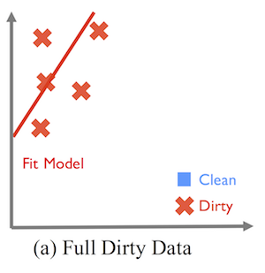
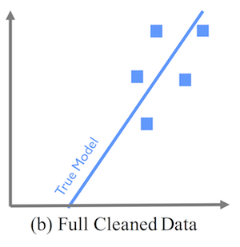
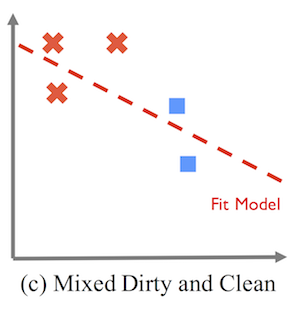
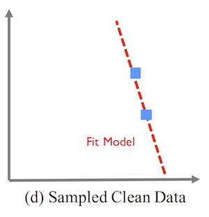

High-quality data is the centerpiece of modern data analytics

## BoostClean 

The holy grail of data cleaning is a system that does it for you.  BoostClean is our first step towards this vision.

Many data science projects and companies follow the process of collecting (dirty) data from a variety of domains, performing extensive data cleaning, and then developing a model.  Ideally the data cleaning effort will actually improve the quality of the model (but as [ActiveClean](#activeclean) showed, this may not be the case!)  In addition, a huge amount of time is spent addressing simple but tedious errors such as  outlier removal, duplicate elimination, imputation, etc.  These are structurally similar, but distinct for every domain and dataset.  Thus the data scientist goes through a list of data cleaning functions (e.g., Python cleaning functions) and manually checks if they apply; if so, then how to parameterize the functions.  

BoostClean attempts to automate this process by treating it as a boosting problem.  Each data cleaning operation effectively adds a new *cleaning* feature to the input of the downstream ML model, and a combination of [Boosting](https://en.m.wikipedia.org/wiki/Boosting_(machine_learning)) and [feature selection](https://en.m.wikipedia.org/wiki/Feature_selection) can be used to identify a good sequence of cleaning operations that will best improve the ML model!

## ActiveClean 

Databases can be corrupted with various errors such as missing, incorrect,
or inconsistent values. Increasingly, modern data analysis
pipelines involve Machine Learning, and the effects of dirty data
can be difficult to debug. Dirty data is often sparse, and naive sampling
solutions are not suited for high-dimensional models. 
The following figures show how data cleaning can _degrade_ the machine learning model.  

  

    
    

      Shows how systematic corruption of data (from circles to crosses) can lead to a shifted, incorrect model.  
    

  

  

    
    

      Illustrates the true model if the full dataset were cleaned.
    

  

  

    
    

      Shows how combining two cleaned records (blue) with the dirty records leads to a <i>worse</i> model than no cleaning.
    

  

  

    
    

      Shows how only using the two cleaned records can also result in a worse model due to sampling error.
    

  

  

ActiveClean is an iterative cleaning framework that can *correctly* retrain the machine learning model 
when data is cleaned, and provides a set of optimizations to select the best data to be cleaned.
In this way, you only need to clean a small subset of the data in order to produce a model similar
to if the full dataset were cleaned.

### Code

The ActiveClean codebase is written in Python and includes the core ActiveClean algorithm, a data cleaning
benchmark, and (in the future), an dirty data detector:

The [Data Cleaning Benchmark](https://github.com/sjyk/datacleaning-benchmark) automatically injects data errors into your datasets to test the robustness
of your machine learning models to data errors.  It can be installed using **pip**:

          pip install cleaningbenchmark

To reproduce our results and run the code, simply [download the files in the following link](https://www.dropbox.com/sh/r2vv252m5lnqpmm/AAAMj0WRaZX9EKH_8dLOHQpIa?dl=0) and run the python file using:

          python activeclean_sklearn.py 

The script is quite simple, so you can read it to see everything in action.

### News

* [Summary on The Morning Paper](https://blog.acolyer.org/2017/10/04/activeclean-interactive-data-cleaning-for-statistical-modeling/)
* [A Data-Cleaning Tool for Building Better Prediction Models](http://datascience.columbia.edu/data-cleaning-tool-building-better-prediction-models)
* [Machine learning tool cleans dirty data](https://gcn.com/articles/2016/10/19/activeclean-big-data.aspx)

### Collaborators

ActiveClean is a collaboration between the [WuLab](http://eugenewu.net/lab.html) at Columbia University, the [AMPLab](https://amplab.cs.berkeley.edu) at University of California, Berkeley, and [Jiannan Wang](https://www.sfu.ca/computing/people/faculty/jiannanwang.html) at Simon Fraser University.

